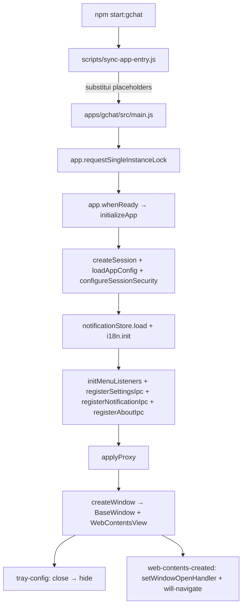
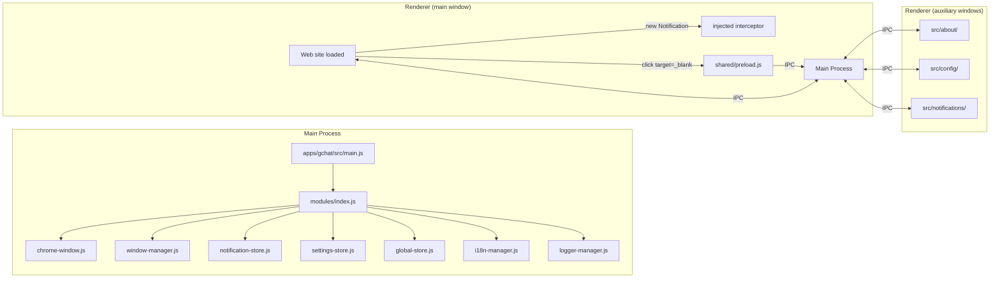

# 01 — Architecture

## Padrão arquitetural identificado

- **Padrão:** Modular Electron (main + renderer) com **template-driven
  multi-app** — um codebase compartilhado, N entries materializados por
  `sync-app-entry.js`.
- **Confiança:** Alta — descrito em nest-forge/CLAUDE.md "Entry flow" e
  observado em `modules/`, `scripts/`, `apps/`.

## Diagrama de boot

## Diagrama de camadas

## Camadas e responsabilidades

| Camada | Path | Responsabilidade |
|---|---|---|
| Main process — entry template | `main.js` | Template com `#default-name-app` e `#default-modules-path` |
| Main process — entry gerado | `apps/{appName}/src/main.js` | Materializado por `sync-app-entry.js`. GITIGNORED. |
| Modules index | `modules/index.js` | Hub central de exports |
| Window | `modules/window-manager.js`, `modules/chrome-window.js`, `modules/chrome-ui/` | `BaseWindow` + `WebContentsView` com titlebar custom, menu horizontal |
| Session | `modules/session-manager.js` | Sessão isolada `persist:{appName}` + proxy + security |
| Stores | `modules/global-store.js`, `modules/notification-store.js`, `modules/settings-store.js` | Estado in-memory + persistência JSON |
| IPC handlers | `modules/menu-manager.js`, `modules/notification-window-manager.js`, `modules/settings-manager.js`, `modules/about-window-manager.js` | Registro de `ipcMain.handle/on` + abertura das janelas auxiliares |
| Preloads | `shared/preload.js`, `src/*/preload.js` | `contextBridge` + interceptor de `target="_blank"` |
| Renderer pages | `src/about/`, `src/config/`, `src/notifications/` | HTML + preload das janelas auxiliares |
| Tray | `shared/components/tray-config.js` | Close → hide to tray |
| i18n | `modules/i18n-manager.js`, `locales/*.json` | `t(key, params)` + emit `changed` |
| Logger | `modules/logger-manager.js` | Winston file + console, toggle runtime |
| Build scripts | `scripts/` | Template-driven build |
| Export para nest-build-app-api/ | `scripts/export-template.js` | Source-of-truth do `nest-build-app-api/templates/electron-base/` |

## Regras de dependência (invariantes observadas)

- **`apps/{appName}/src/main.js` é GERADO** — gitignored. Nunca editar
  manualmente. Editar `main.js` raiz e rodar `sync-app-entry.js` (já
  encadeado em `start:*` e `build:*`).
  Evidência: nest-forge/CLAUDE.md "Entry flow" + caveats.

- **`extraMetadata.name = appName` NUNCA é setado em `build-app.js`.**
  Isso mudaria `app.getName()` no build empacotado, deslocando
  `userData` de `~/.config/NestApp/` para `~/.config/{appName}/` —
  perda de sessão, store de notificações vazio, click-replay quebrado.
  Solução para WM_CLASS único: `--class={appName}` na `.desktop`.
  Evidência: nest-forge/CLAUDE.md "Caveats" + `installAppImage.js`.

- **Shared preload intercepta APENAS anchors com `target="_blank"`.**
  Interceptar todo `http*` quebrava navegação interna de SPAs. Não
  restaurar comportamento antigo.
  Evidência: nest-forge/CLAUDE.md "Caveats" + `shared/preload.js`.

- **`will-navigate` decide via heurística "mesmo root domain" (últimos
  dois labels do hostname).** Falha em compound TLDs (`.co.uk`, `.com.br`
  registrable). Onboarding de app com compound TLD exige `allowedHosts`
  explícito em `config.json`.
  Evidência: nest-forge/CLAUDE.md "Caveats".

- **`safeReplaceFile` em `installAppImage.js`** — `unlink + copy` para
  evitar `ETXTBSY` em reinstalações com app rodando.
  Evidência: nest-forge/CLAUDE.md "installer" + caveats.

- **Notification interceptor re-injetado em `dom-ready`,
  `did-finish-load`, `did-navigate-in-page`** — guard `window.__nestappNotifPatched`
  torna re-injeção no-op.
  Evidência: nest-forge/CLAUDE.md "Notification flow".

- **Templates em `templates/api-overlay/` são overlay api-only** — não
  fazem parte do runtime do framework; só usados por `export-template.js`.

## Módulos / bounded contexts

| Módulo | Path | Propósito |
|---|---|---|
| App lifecycle | `apps/*/`, `scripts/sync-app-entry.js` | Materializar entry per-app |
| Window chrome | `modules/chrome-*`, `modules/window-manager.js` | BaseWindow + WebContentsView + titlebar dark |
| Web session | `modules/session-manager.js` | Persistir cookies/storage por app |
| Notifications | `modules/notification-store.js`, `modules/notification-window-manager.js`, `injectNotificationInterceptor` | Captura `new Notification()` → store → janela de listagem → replay click |
| Settings | `modules/settings-manager.js`, `modules/settings-store.js`, `src/config/` | Janela de proxy/extensions/language/keep-active |
| About | `modules/about-window-manager.js`, `modules/app-info.js`, `src/about/` | Janela About (consome `nestApp` injected) |
| i18n | `modules/i18n-manager.js`, `locales/` | t() + reativo |
| Build/Export | `scripts/build-*.js`, `scripts/export-template.js` | electron-builder + export para nest-build-app-api/ |

## Pontos de extensibilidade

- **Adicionar app:** `apps/{appName}/config.json` + `package.json` +
  `assets/icon.png` + scripts no root `package.json`.
- **Adicionar idioma:** novo `locales/{lang}.json`.
- **Adicionar permissões/extensões:** `apps/{appName}/config.json`
  (permissions, extensions list).
- **Override de heurística de navegação:** trocar
  `will-navigate.isInternalNavigation` por `allowedHosts` quando app
  exigir.
