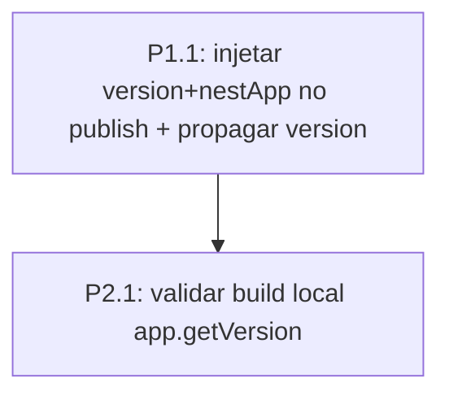

# 04 — Plan (Plano de Execução)

> Tasks priorizadas + DAG. APROVAÇÃO EXPLÍCITA antes da Fase 5.

**Slug:** nestforge-template-version-sync
**Subprojeto:** nest-forge
**Status:** Draft
**Última revisão:** 2026-06-08

---

## Resumo

- Total de tasks: 2 (0 P0, 1 P1, 1 P2)
- Tempo estimado: ~40min
- Arquivos a modificar: 1 (`scripts/publish-template.js`)
- Arquivos a criar: 0
- Skills auxiliares: clean-code
- Riscos: electron-builder respeitar `extraMetadata.nestApp`; efeito só após republicar

## Diagrama de dependências (DAG)



---

## P1 — Core

### Task P1.1 — Injetar versão do template no publish

**ID:** P1.1
**Tipo:** modify
**Arquivo(s):** `scripts/publish-template.js`
**Depende de:** nenhuma
**Estimativa:** ≤20min
**Skill auxiliar sugerida:** clean-code

**Descrição técnica:**
1. `runElectronBuilderDir(platform, arch)` →
   `runElectronBuilderDir(platform, arch, version)`; ajustar o(s) call site(s)
   em `run()` (onde `version` já existe) para passar `version`.
2. `writePublishConfig(ociMainRelative)` →
   `writePublishConfig(ociMainRelative, version)`; no `extraMetadata` adicionar
   `version` e `nestApp: { name: 'nestapp-template', version }`:
   ```js
   extraMetadata: {
       main: ociMainRelative,
       name: 'nestapp-template',
       version,
       nestApp: { name: 'nestapp-template', version }
   }
   ```
   NÃO alterar `name`. Sem emojis.

**Segurança:**
- Validação: `version` derivado de `template.json`/arg (não input externo).
- Auth/authz: n/a. Error handling: fluxo de erro do script inalterado.
- Sanitização: n/a.

**Boas práticas:**
- SOLID — S: `writePublishConfig` só monta o config. DRY: reutiliza o
  `version` já calculado. Null safety: `version` validado em `readTemplateInfo`
  (throw se ausente).

**Design pattern:** nenhum.

**Critério de conclusão:**
- [ ] `extraMetadata` inclui `version` + `nestApp`; `name` inalterado.
- [ ] `runElectronBuilderDir`/`writePublishConfig` propagam `version`.
- [ ] `node -c scripts/publish-template.js` (sintaxe) OK.
- [ ] `node scripts/export-template.js --check` e `build:gchat` não quebram.

**Testes da task:** validação na P2.1.

---

## P2 — Complementar

### Task P2.1 — Validar versão assada (build local)

**ID:** P2.1
**Tipo:** test
**Arquivo(s):** nenhum de produção (execução; nota em `05-execution.md`)
**Depende de:** [P1.1]
**Estimativa:** ≤20min
**Skill auxiliar sugerida:** verify

**Descrição técnica:**
Rodar o passo de empacotamento local (sem publicar no GHCR): `node
scripts/publish-template.js --dry-run` (ou disparar só o electron-builder
`--dir` via o fluxo). Inspecionar `dist/{platform}-unpacked` →
`resources/app.asar` (extrair com `npx asar extract` ou `npx asar list`) →
`package.json.version`, OU rodar o binário e checar `app.getVersion()`.
Confirmar que == `template.json.version` (não 3.0.0). Registrar em
`05-execution.md`. Observar que o artefato OCI 3.1.0 já publicado NÃO muda —
só novos publishes.

**Segurança:** n/a (validação). **Boas práticas:** n/a.

**Critério de conclusão:**
- [ ] `app.asar/package.json.version` (ou `app.getVersion()`) ==
      `template.json.version`.
- [ ] "Empacotado pelo nestapp-template" passaria a mostrar a versão do
      template (via `extraMetadata.nestApp`).
- [ ] export-template `--check` / build:gchat sem regressão.

**Testes da task:** o próprio build local + inspeção.

---

## Verificação de constitution

| Task | Princípio | Status | Justificativa |
|---|---|---|---|
| P1.1 | §7 dois namespaces (template vs framework) | ✓ | Só decide qual o artefato expõe; `package.json` inalterado |
| P1.1 | §5 NÃO setar `extraMetadata.name = appName` | ✓ | `name` inalterado; só `version`/`nestApp` |
| P1.1 | §2 sem emojis / teste manual | ✓ | — |
| P1.1 | ADR-0001 (publicação OCI) | ✓ | Correção dentro do fluxo OCI; nota a adicionar no ADR-0001 (Fase 6) |
| P2.1 | §2 validação manual | ✓ | Build local + inspeção |

> Nenhum ⚠ — sem override.

## Skills auxiliares envolvidas

| Task | Skill | Modo |
|---|---|---|
| P1.1 | clean-code | sugerida |
| P2.1 | verify | sugerida |

## Tasks não-atômicas

Nenhuma. P1.1 é aditiva no config; o script continua funcional.

## Riscos consolidados

- **electron-builder ignorar `extraMetadata.nestApp`** — prob. baixa (build-app.js
  já usa) / impacto médio. Mitigação: validar no build local (P2.1).
- **Efeito só após republicar** — prob. certa / impacto baixo. Mitigação:
  documentar; republish é operação à parte.

---

> **Checkpoint 3 (CRÍTICO):** requer autorização explícita antes de modificar
> arquivos. Vai em branch própria + PR no nest-forge.
>
> - [ ] **Autorizado para execução**
> - [ ] Ajustar tasks
> - [ ] Voltar à spec
> - [ ] Abortar
